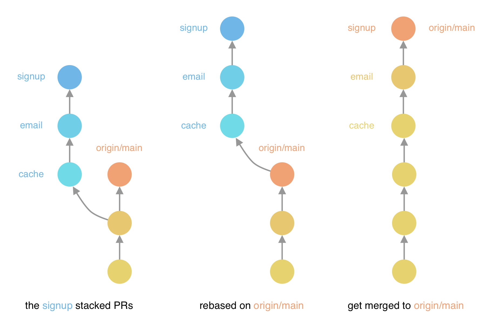
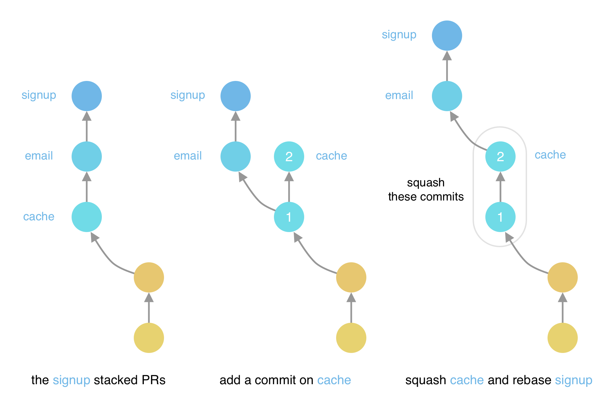

# git-stack

While working with GitHub, I missed the flow of `git-review` from [Gerrit](https://www.gerritcodereview.com/). This project is an attempt to bring the same flow to GitHub.

## What is `git-stack`?

`git-stack` is a command line tool that helps you to review your changes on GitHub. It is inspired by `git-review` from Gerrit.

Read this guide to have a better understand of how working with Gerrit looks like: [Working with Gerrit](https://gerrit-review.googlesource.com/Documentation/intro-gerrit-walkthrough.html).

### The stacked PR workflow

Let's say you are working on a large PR, says **user sign up**, and it has 3 parts: **cache**, **email client** and **the actual sign up flow**. The email client depends on cache and the sign up flow depends on both of them. You want to split the PR to 3 different PRs, so that you can get them reviewed and merged separately.

#### Rebase PRs on origin/main



Now some other PRs get merged to `origin/main`, and you want to incorporate their work. You can do this with `git rebase`:

```sh
git checkout cache         # switch to the branch cache
git rebase origin/main     # rebase on origin/main
git push -f origin cache   # push the change 

git checkout email
git rebase cache
git push -f origin email

git checkout signup
git rebase email
git push -f origin signup
```

#### Make change to a PR



Another case is when you discover some bug in the `cache` branch and want to add a commit to fix it, says commit **(2)**. Now the `signup` and `email` branches are out of date. They no longer stack above the `cache` branch. You can fix this with squash and `git rebase`:

```sh
git checkout cache          # switch to the branch cache
git rebase -i HEAD~1        # squash
                            # update the commit message
git push -f origin cache    # push the change    

git checkout email
git rebase cache
git push -f origin email

git checkout signup
git rebase email
git push -f origin signup
```

The benefit of this workflow is that each PR represents an individual change. It makes the review process easier and faster.

But the downside is, too many commands to type.

## Installation

- Have [Go](https://go.dev) installed.
- Run `go get github.com/kevgo/git-stack`.
- Put `git-stack` in your `$PATH`.
